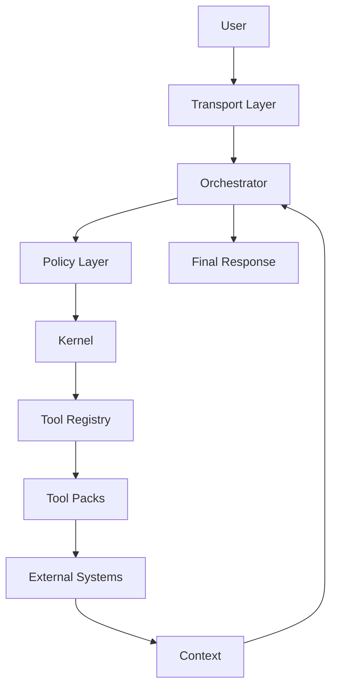

# Architecture — AI Control Plane Runtime

This document provides a deep dive into the architecture of the AI Control Plane Runtime.

It explains how the system is structured, how execution flows through the runtime, and how core components interact to enable safe, extensible agent execution.

---

## 🧠 System Overview

The runtime implements a **control-plane-oriented architecture** for AI systems.

It separates:

- reasoning (LLM / planner)
- orchestration (agent loop)
- governance (policy layer)
- execution (kernel)
- capabilities (tool system)
- knowledge systems (external RAG)

This separation allows the system to be:

- modular
- extensible
- safe by design
- production-ready

---

## 🏗️ High-Level Architecture



<p align="center">
  
</p>

## 🔁 Execution Flow

## 🔄 Agent Execution Model

The orchestrator implements a ReAct-style agent loop.

```text
while (true):
  decision = planner(prompt, history)

  if decision is final:
    return response

  if decision is tool:
    result = execute(tool)
    history.append(result)
```

## Capabilities

- multi-step reasoning
- dynamic tool invocation
- iterative context building

## 🧩 Layered Architecture

```text
Transport
   ↓
Orchestrator
   ↓
Policy
   ↓
Kernel
   ↓
Tools
   ↓
External Systems
```

Each layer has a single responsibility.

---

## 🔌 Layer Responsibilities

### Transport Layer

Handles communication with the runtime.

Responsibilities:

- receive requests (`STDIO`)
- parse JSON messages
- route requests to orchestrator or kernel
- return structured responses

Future support:

- HTTP
- WebSocket

### Orchestrator

The control layer of the runtime.

Responsibilities:

- run the agent loop
- maintain execution history
- interact with the planner (LLM)
- decide when to call tools
- return final responses

### Policy Layer

The governance layer.

Responsibilities:

- enforce tool allowlists
- restrict unsafe capabilities
- define execution constraints

Example:

```js
ALLOWED_TOOLS = ["echo", "add", "sleep", "searchDocuments"];
```

Policy sits between reasoning and execution.

### Kernel

The execution boundary.

All tool execution must pass through the kernel.

Responsibilities:

- validate tool requests
- validate arguments (schema)
- resolve tools from registry
- enforce timeouts
- execute tools safely
- normalize errors
- log invocations

The kernel acts as a firewall for execution.

### Tool Registry

Maps tool names to implementations.

Responsibilities:

- dynamic tool lookup
- decoupling orchestration from execution

### Tool Packs

Tools are grouped by domain.

```text
core/
rag/
(future) repo-tools/
(future) ci-tools/
```

Benefits:

- modular capability expansion
- avoids monolithic system growth

### External Systems

The runtime does not store knowledge internally.

Instead, it integrates with external systems.

Examples:

- RAG system (`rag-mdn`)
- vector database (`pgvector`)
- external APIs

---

## 🛡️ Safety Model

The runtime enforces safety through layered controls.

### Policy Enforcement

- tool allowlists
- capability restrictions

### Kernel Protections

- schema validation
- execution timeouts
- structured error handling

### Error Types

- `validation_error`
- `unknown_tool`
- `timeout`
- `execution_error`
- `policy_violation`

---

## 📊 Execution Trace (Conceptual)

```text
Prompt
  ↓
Tool Call: searchDocuments
  ↓
Observation: retrieved documents
  ↓
Final Response
```

---

## 🧭 Control Plane Model

| Layer        | Role                        |
| ------------ | --------------------------- |
| Orchestrator | decision-making (reasoning) |
| Policy       | governance                  |
| Kernel       | execution enforcement       |
| Tools        | capabilities                |
| External     | data / systems of record    |

This allows:

- safe extensibility
- runtime governance
- composable capabilities

---

## 🔮 Future Extensions

### Model Integration

- GPT
- Claude
- Gemini

### Agent Memory

- conversation state
- task tracking
- persistent context

### Tool Expansion

- repository analysis
- CI/CD automation
- external APIs

### Observability

- execution tracing
- metrics
- logging
- debugging tools

---

## 🔧 Runtime Extensions (Tooling & Capability Model)

### Tool Naming Convention

Tools are namespaced by their tool pack to ensure scalability and avoid collisions.

Format:

```text
<pack>.<tool>
```

Examples:

```text
rag.searchDocuments
repo.readFile
api.fetchJSON
```

---

### Tool Pack Registration

Tool packs are registered at runtime startup and provide a grouped set of capabilities.

Each tool pack defines:

- `name` — unique identifier
- `tools` — list of tool definitions
- `schemas` — validation for tool inputs
- `execute` — tool implementation

Example:

```ts
export const repoToolsPack = {
  name: "repo",
  tools: [readFile, listFiles, searchCode],
};
```

The runtime registers packs:

```ts
registerToolPack(repoToolsPack);
```

---

### Tool Discovery (Planner Awareness)

The planner must be aware of available tools.

The runtime exposes tool metadata:

```ts
availableTools = registry.list();
```

Each tool includes:

- name
- description
- input schema

The planner uses this to decide:

- whether to call a tool
- which tool to call

---

### Capability Routing

The runtime functions as a capability router.

Flow:

```text
Planner → Tool Selection → Kernel → Tool Pack → External System
```

The planner selects a tool based on:

- task intent
- available capabilities
- tool descriptions

The kernel executes the selected tool safely.

---

### Observability (Minimal)

The runtime records tool execution for debugging and tracing.

Example:

```ts
{
  tool: "repo.readFile",
  pack: "repo",
  duration: 120,
  timestamp: 123456
}
```

This enables:

- execution tracing
- debugging
- performance visibility

---

## 🧾 Summary

The AI Control Plane Runtime provides:

- a layered execution architecture
- safe tool invocation via a kernel boundary
- governance through a policy layer
- extensible capabilities via tool packs
- decoupled knowledge systems

It serves as a foundation for building scalable AI agent platforms.
