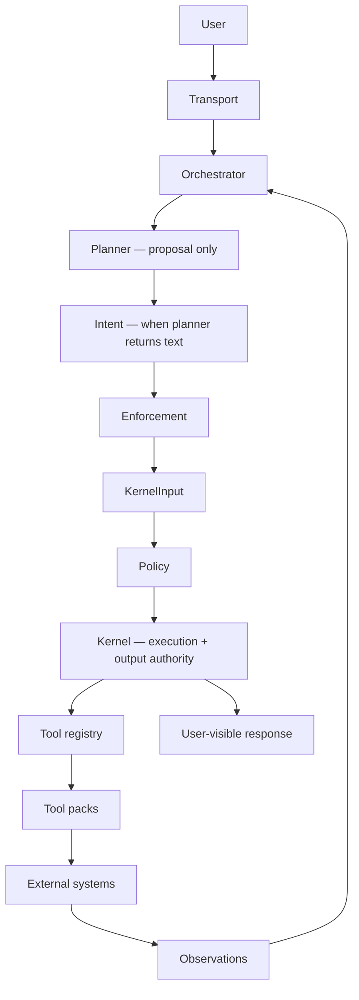

# Architecture — AI Control Plane Runtime

This document provides a deep dive into the architecture of the AI Control Plane Runtime.

It explains how the system is structured, how execution flows through the runtime, and how core components interact to enable safe, extensible agent execution.

---

## 🧠 System Overview

The runtime implements a **control-plane-oriented architecture** for AI systems.

It separates:

- reasoning (LLM / planner)
- orchestration (agent loop)
- governance (policy layer)
- execution (kernel)
- capabilities (tool system)
- knowledge systems (external RAG)

This separation allows the system to be:

- modular
- extensible
- safe by design
- production-ready

---

## 🏗️ High-Level Architecture

The diagram fixes an earlier modeling bug: **user-visible output is emitted only after the kernel** (`KernelInput → executeKernel → response`), not from the orchestrator or planner directly.

Source file (regenerate the PNG after edits): `docs/diagrams/runtime-execute.mmd`.



<p align="center">
  
</p>

## 🔁 Execution Flow

Runtime integration follows a single contract:

```text
orchestrate(prompt) → KernelInput → executeKernel(KernelInput) → user-visible response
```

The orchestrator **never** returns raw model strings as the final transport payload; callers pass its `KernelInput` through `executeKernel`, which is the only place structured chat, refusal, and tool execution results are produced for output.

## 🔄 Agent Execution Model

The orchestrator implements a ReAct-style loop, but the planner **proposes only**. When the planner returns plain text, an **intent** step classifies whether the user’s request required tool execution; the orchestrator **enforces** that classification so the model cannot finalize tool work without going through policy and the kernel.

```text
decision = planner(prompt, history)

if decision is plain text:
  intent = classifyIntent(prompt)   // control signal: was a tool required?
  if intent.requiresTool:
    KernelInput = refusal             // no planner bypass
  else:
    KernelInput = { type: "chat", message: decision }

if decision is tool call:
  result = policy → kernel → tool (with normalization + bounded retry on validation)
  KernelInput = chat or refusal wrapping the outcome

return KernelInput   // always structured; output via executeKernel
```

## Capabilities

- multi-step reasoning
- dynamic tool invocation
- iterative context building
- intent-aware enforcement and structured failure handling (see changelog)

## 🧩 Layered Architecture

```text
Transport
   ↓
Orchestrator (planner + intent + enforcement → KernelInput)
   ↓
Policy
   ↓
Kernel (executeKernel — execution + output authority)
   ↓
Tools
   ↓
External Systems
```

Each layer has a single responsibility.

---

## 🔌 Layer Responsibilities

### Transport Layer

Handles communication with the runtime.

Responsibilities:

- receive requests (`STDIO`)
- parse JSON messages
- route prompt requests through `orchestrate` → `executeKernel`
- route direct tool requests through policy → kernel
- return structured responses (never raw undecorated model strings)

Future support:

- HTTP
- WebSocket

### Orchestrator

The control layer of the runtime.

Responsibilities:

- run the agent loop
- maintain execution history
- interact with the planner (LLM) — **proposal only**
- classify **intent** when the planner returns free text (was a tool required?)
- **enforce** execution constraints: if a tool was required but the planner returned only text, emit structured refusal instead of accepting the string as output
- produce a **`KernelInput`** for every turn (never hold final output authority)

The orchestrator does **not** emit user-visible responses by itself; it prepares input for `executeKernel`.

### Policy Layer

The governance layer.

Responsibilities:

- enforce tool allowlists
- restrict unsafe capabilities
- define execution constraints

Example:

```js
ALLOWED_TOOLS = ["echo", "add", "sleep", "searchDocuments"];
```

Policy sits between reasoning and execution.

### Kernel

The execution boundary and **single output authority** for the unified contract.

All tool execution must pass through the kernel. **`executeKernel`** is the uniform entry for:

- `type: "tool"` — delegate to `handleKernelRequest` (validation, normalization, execution)
- `type: "chat"` — structured chat payload
- `type: "refusal"` — structured refusal payload

Responsibilities:

- validate tool requests
- validate arguments (schema)
- resolve tools from registry
- enforce timeouts
- execute tools safely
- normalize errors
- log invocations
- emit structured shapes consumed by the transport layer

The kernel acts as a firewall for execution and the locus of **validated, user-visible output** for this contract.

### Tool Registry

Maps tool names to implementations.

Responsibilities:

- dynamic tool lookup
- decoupling orchestration from execution

### Tool Packs

Tools are grouped by domain.

```text
core/
rag/
(future) repo-tools/
(future) ci-tools/
```

Benefits:

- modular capability expansion
- avoids monolithic system growth

### External Systems

The runtime does not store knowledge internally.

Instead, it integrates with external systems.

Examples:

- RAG system (`rag-mdn`)
- vector database (`pgvector`)
- external APIs

---

## 🛡️ Safety Model

The runtime enforces safety through layered controls.

### Policy Enforcement

- tool allowlists
- capability restrictions

### Kernel Protections

- schema validation
- execution timeouts
- structured error handling

### Error Types

- `validation_error`
- `unknown_tool`
- `timeout`
- `execution_error`
- `policy_violation`

---

## 📊 Execution Trace (Conceptual)

```text
Prompt
  ↓
Planner proposal → (tool path) policy → kernel → tool
  ↓
Observation: retrieved documents
  ↓
KernelInput → executeKernel → user-visible response
```

---

## 🧭 Control Plane Model

| Layer        | Role |
| ------------ | ---- |
| Planner      | proposes tool calls or text (no final authority) |
| Intent       | control signal: what kind of request is this? (e.g. tool vs chat) |
| Orchestrator | enforcement loop; builds `KernelInput` |
| Policy       | governance before kernel execution |
| Kernel       | execution + **output authority** (`executeKernel`) |
| Tools        | capabilities |
| External     | data / systems of record |

This allows:

- safe extensibility
- runtime governance
- composable capabilities

---

## 📜 Runtime evolution (intent, enforcement, output authority)

The system moved from a **model-driven** ReAct loop (where a string “final answer” could bypass validation) to a **governed control-plane runtime**:

1. **Failure semantics (v0.2)** — deterministic vs transient errors; structural normalization; bounded, signal-driven retry when validation fails and normalization cannot fix input.
2. **Intent (detection)** — `classifyIntent` answers what kind of request this is (`requiresTool`, `type`), instead of trusting only “what the model returned.”
3. **Orchestrator (enforcement)** — if a tool was required but the planner returned plain text, the runtime emits a structured refusal (`tool_required_but_not_used`) rather than returning that text as a successful answer.
4. **Kernel (execution + output authority)** — `KernelInput` is the sole contract out of the orchestrator; **`executeKernel`** is the single emission path for structured chat, refusal, and tool execution results.

**Principles:** model proposes → orchestrator enforces → kernel executes and emits; no execution without validation; single output authority at the kernel boundary.

---

## 🔮 Future Extensions

### Model Integration

- GPT
- Claude
- Gemini

### Agent Memory

- conversation state
- task tracking
- persistent context

### Tool Expansion

- repository analysis
- CI/CD automation
- external APIs

### Observability

- execution tracing
- metrics
- logging
- debugging tools

---

## 🔧 Runtime Extensions (Tooling & Capability Model)

### Tool Naming Convention

Tools are namespaced by their tool pack to ensure scalability and avoid collisions.

Format:

```text
<pack>.<tool>
```

Examples:

```text
rag.searchDocuments
repo.readFile
api.fetchJSON
```

---

### Tool Pack Registration

Tool packs are registered at runtime startup and provide a grouped set of capabilities.

Each tool pack defines:

- `name` — unique identifier
- `tools` — list of tool definitions
- `schemas` — validation for tool inputs
- `execute` — tool implementation

Example:

```ts
export const repoToolsPack = {
  name: "repo",
  tools: [readFile, listFiles, searchCode],
};
```

The runtime registers packs:

```ts
registerToolPack(repoToolsPack);
```

---

### Tool Discovery (Planner Awareness)

The planner must be aware of available tools.

The runtime exposes tool metadata:

```ts
availableTools = registry.list();
```

Each tool includes:

- name
- description
- input schema

The planner uses this to decide:

- whether to call a tool
- which tool to call

---

### Capability Routing

The runtime functions as a capability router.

Flow:

```text
Planner → Tool Selection → Policy → Kernel → Tool Pack → External System
```

The planner selects a tool based on:

- task intent
- available capabilities
- tool descriptions

The kernel executes the selected tool safely. Separately, **intent classification** constrains what happens when the planner returns text instead of a tool call (see orchestrator enforcement).

---

### Observability (Minimal)

The runtime records tool execution for debugging and tracing.

Example:

```ts
{
  tool: "repo.readFile",
  pack: "repo",
  duration: 120,
  timestamp: 123456
}
```

This enables:

- execution tracing
- debugging
- performance visibility

---

## 🧾 Summary

The AI Control Plane Runtime provides:

- a layered execution architecture with **intent**, **enforcement**, and a **kernel output boundary**
- safe tool invocation via the kernel (`handleKernelRequest`) and unified responses via **`executeKernel`**
- governance through a policy layer
- extensible capabilities via tool packs
- decoupled knowledge systems

**One-line evolution:** the runtime grew from a model-driven agent into a governed control-plane by adding intent classification, orchestrator enforcement against planner bypass, and centralizing user-visible output through the kernel.

It serves as a foundation for building scalable AI agent platforms.
