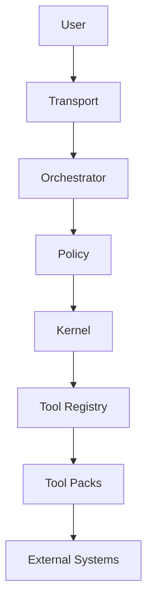

# AI Control Plane Runtime

A layered AI runtime system for safe, extensible, tool-enabled agent execution.

## ⚡ What This System Does

This project is a control-plane runtime for AI systems that allows a language model to safely interact with real-world tools like codebases, APIs, and data systems.

Instead of letting the model execute actions directly, the system separates:

- reasoning → what the model wants to do
- execution → what the system allows to happen

Every action goes through:

- Policy → is this allowed?
- Kernel → is this valid and safe?
- Tools → perform the actual work

This ensures the model can suggest actions, but the system controls execution.

👉 The result is a safer, more reliable way to use AI for real tasks like debugging, retrieval, and automation.

---

## 🧠 Overview

This project implements a **control-plane-oriented architecture** for LLM-powered systems, separating:

- reasoning (planner)
- orchestration (agent loop)
- governance (policy)
- execution (kernel)
- capabilities (tools)
- knowledge systems (RAG)

---

## 🏗️ Architecture

