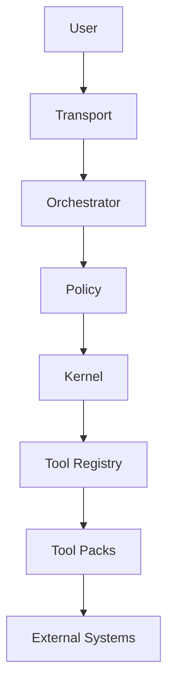

# AI Control Plane Runtime

A layered AI runtime system for safe, extensible, tool-enabled agent execution.

---

## 🧠 Overview

This project implements a **control-plane-oriented architecture** for LLM-powered systems, separating:

- reasoning (planner)
- orchestration (agent loop)
- governance (policy)
- execution (kernel)
- capabilities (tools)
- knowledge systems (RAG)

---

## 🏗️ Architecture

